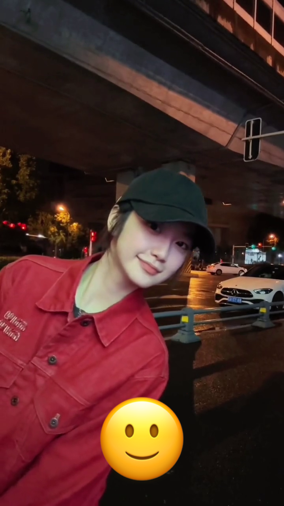
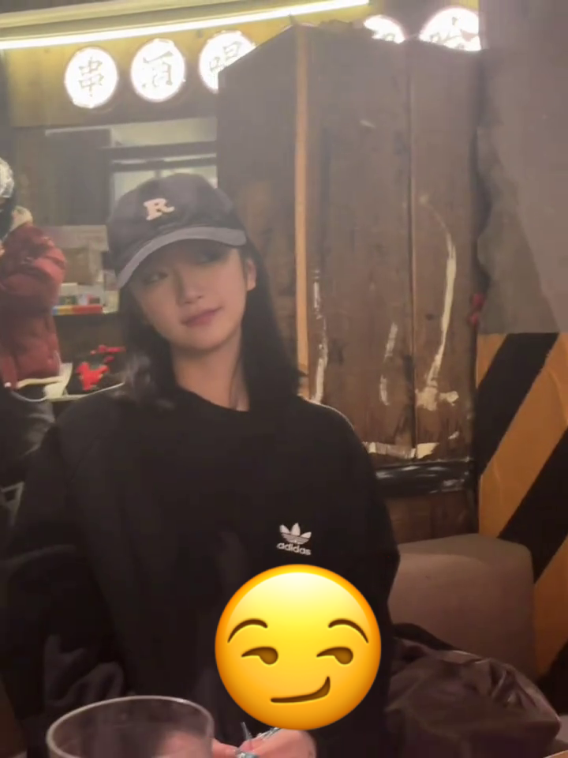

<div align="center">

# ZTT Sticker
<figure>
        
        <figcaption></figcaption>
    </figure>
</div>

## Usage

First, use `pip` to download the `opencv-python` and `pillow` package.

```bash
conda create ztt python=3.10
conda activate ztt
pip install -r requirements.txt
```

Then, run the following command to extract all the frames from target video, e.g.,
the following video:

https://github.com/user-attachments/assets/7b1b2f0d-529b-4409-adcd-2d215c9fbe4c

```bash
python scripts/extract_frames.py videos/捏我脸.mp4
python scripts/create_gif.py output/捏我脸/捏我脸_{0173..0240}.png --fps 30
```

## Gallery

<div align="center" style="text-align: center;">

### Images
<table>
    <tr>
        <td>
            <br>
            <p>slight smile</p>
        </td>
        <td>
            <br>
            <p>slight smile</p>
        </td>
    </tr>
    <tr>
        <td>
            <br>
            <p>smirking</p>
        </td>
        <td>
            <br>
            <p>winking</p>
        </td>
    </tr>
</table>
</div>

<div align="center" style="text-align: center;">

### GIFs
<table>
    <tr>
        <td>
            
        </td>
        <td>
            
        </td>
    </tr>
    <tr>
        <td>
            
        </td>
        <td>
            
        </td>
    </tr>
</table>
</div>

## TODO

- [ ] Integrate FaceRate.ai, an AI tool for evaluating facial attractiveness, to rank the extracted frames. This will involve using the FaceRate.ai API to analyze each frame and assign a score based on facial features.
- [ ] Automatically identify the emoji that best matches the extracted frame’s portrait and insert it into the frame.

## Related Resources

- [louiejancevski/FacialEmotionDetector](https://github.com/louiejancevski/FacialEmotionDetector)
- [facerate.ai](https://facerate.ai/app)
- [kdhht2334/awesome-SOTA-FER](https://github.com/kdhht2334/awesome-SOTA-FER)
- [Facial Beauty Prediction](https://paperswithcode.com/task/facial-beauty-prediction)
- [SCUT-FBP5500-Database-Release](https://github.com/HCIILAB/SCUT-FBP5500-Database-Release)
- [Image Quality Assessment](https://paperswithcode.com/task/image-quality-assessment)
- [chaofengc/Awesome-Image-Quality-Assessment](https://github.com/chaofengc/Awesome-Image-Quality-Assessment)
- [nilaoda/N_m3u8DL-RE](https://github.com/nilaoda/N_m3u8DL-RE)
- [wbt5/real-url](https://github.com/wbt5/real-url)
